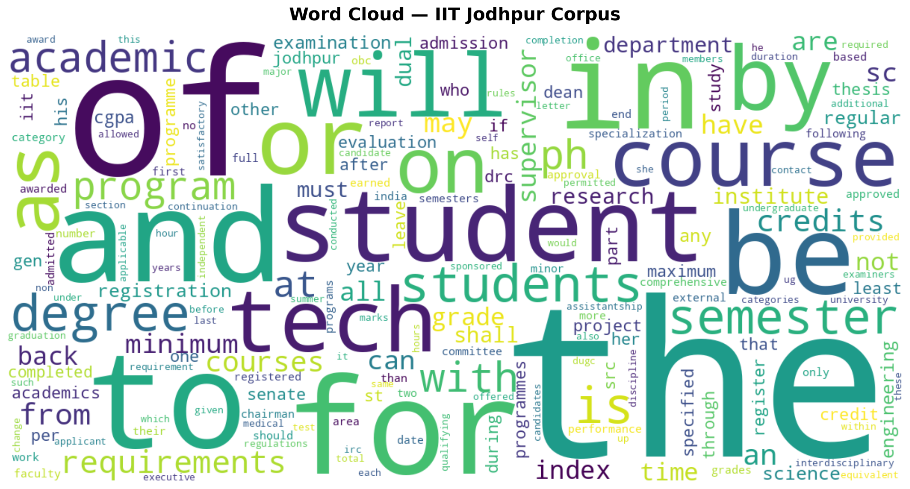
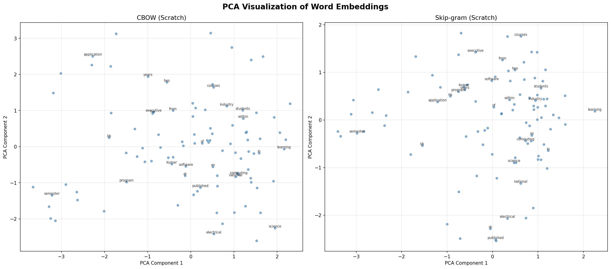
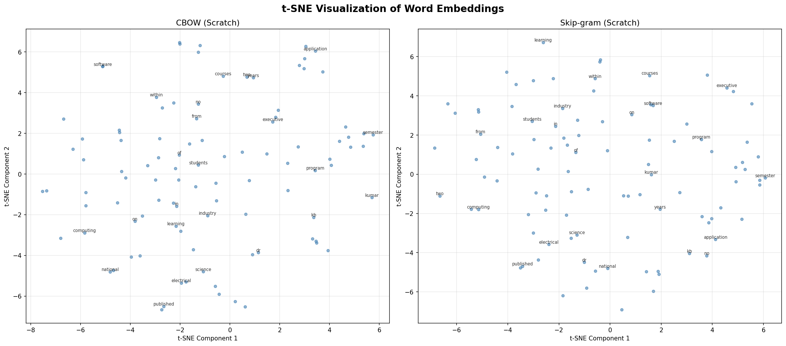
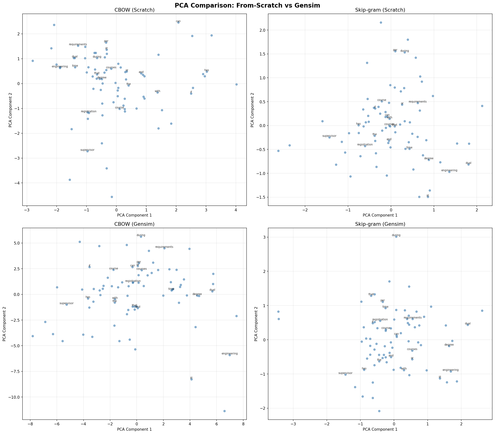
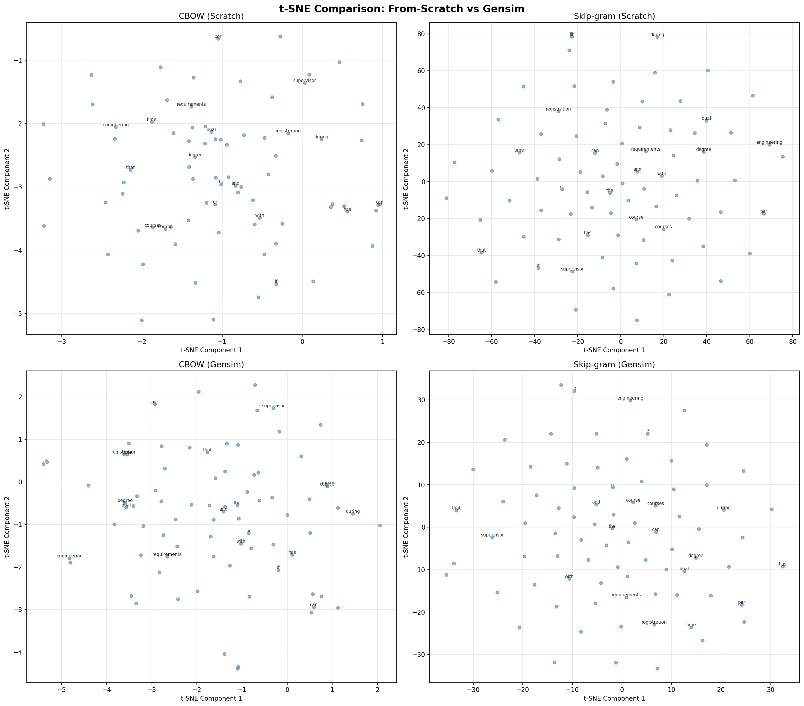

# NLU Assignment 2: Word Embeddings & RNN Name Generation

**Author:** Jai Shankar Azad  
**Roll No:** M25CSA014

This repository contains the source code for Programming Assignment 2, which involves training Word2Vec models on a custom IIT Jodhpur corpus and implementing character-level RNN models for Indian name generation.

## Project Structure

- `scrape_iitj.py` - Scrapes IIT Jodhpur websites to build a custom text corpus (`cleaned_corpus.txt`).
- `p1_stats_wordcloud.py` - Computes dataset statistics and generates the `wordcloud.png` visualization.
- `p1_word2vec_scratch.py` - Implements, trains, evaluates, and visualizes Word2Vec (CBOW & Skip-gram) entirely from scratch in PyTorch.
- `p1_word2vec_gensim.py` - Trains and evaluates equivalent Word2Vec models using the `gensim` library for comparison.
- `p2_models.py` - Contains the PyTorch class definitions for Vanilla RNN, Bidirectional LSTM, and RNN+Attention.
- `p2_train_eval.py` - Trains the three character-level RNN models on `TrainingNames.txt`, performs quantitative/qualitative evaluations, and saves the generated names.
- `Report.tex` / `Report.pdf` - The final compiled report containing theory, analysis, comparisons, and outputs.

## Setup Instructions

It is highly recommended to run the code within a Python virtual environment.

### 1. Create and Activate Virtual Environment
```bash
# Create virtual environment
python3 -m venv venv

# Activate it (Linux/Mac)
source venv/bin/activate
```

### 2. Install Dependencies
Install the required Python packages:
```bash
pip install torch torchvision torchaudio numpy matplotlib wordcloud beautifulsoup4 requests gensim scikit-learn
```

---

## How to Run the Code

Activate your virtual environment before running the scripts!

### Problem 1: Word Embeddings (IIT Jodhpur Data)

**Task 1: Data Collection & Statistics**
To collect the texts and generate the cleaned corpus, run:
```bash
python scrape_iitj.py
```
*(This will generate `cleaned_corpus.txt`)*

Next, to compute dataset statistics and generate the Word Cloud:
```bash
python p1_stats_wordcloud.py
```
*(This generates the `wordcloud.png` image)*



**Tasks 2, 3 & 4: Model Training, Semantic Analysis, and Visualizations**
To train the CBOW & Skip-gram models **from scratch**, print the nearest neighbors and analogies, and generate the PCA/t-SNE plots:
```bash
python p1_word2vec_scratch.py
```
*(This takes some time. It will output `pca_embeddings.png` and `tsne_embeddings.png`, as well as save the model weights.)*

**Scratch Model Embeddings:**



To train the equivalent models using **Gensim** and compare:
```bash
python p1_word2vec_gensim.py
```
*(This outputs `comparison_pca.png` and `comparison_tsne.png`)*

**Comparison (Scratch vs Gensim):**



---

### Problem 2: Character-Level Name Generation

**Tasks 1, 2 & 3: Model Architecture, Quantitative & Qualitative Evaluation**
Make sure the `TrainingNames.txt` dataset file is located in the same directory. To train the Vanilla RNN, BLSTM, and RNN+Attention models, and to generate names for evaluation:
```bash
python p2_train_eval.py
```
*(This script will train all three models sequentially. It will print the training loss progression, trainable parameters, generation outputs, novelty percentages, and diversity scores. It will also dump the generated names into separate `.txt` files.)*

---

## Deliverables Generated
After running all the above scripts sequentially, the following outputs will be populated in your directory:
- Custom Text Corpus: `corpus.txt`
- Generated Indian Names: `generated_vanilla_rnn.txt`, `generated_blstm.txt`, `generated_rnn_plus_attention.txt`
- Visualizations: `.png` files for word clouds and embedding projections.
- Trained Model Weights: `.npy` matrices and `.model` files.
